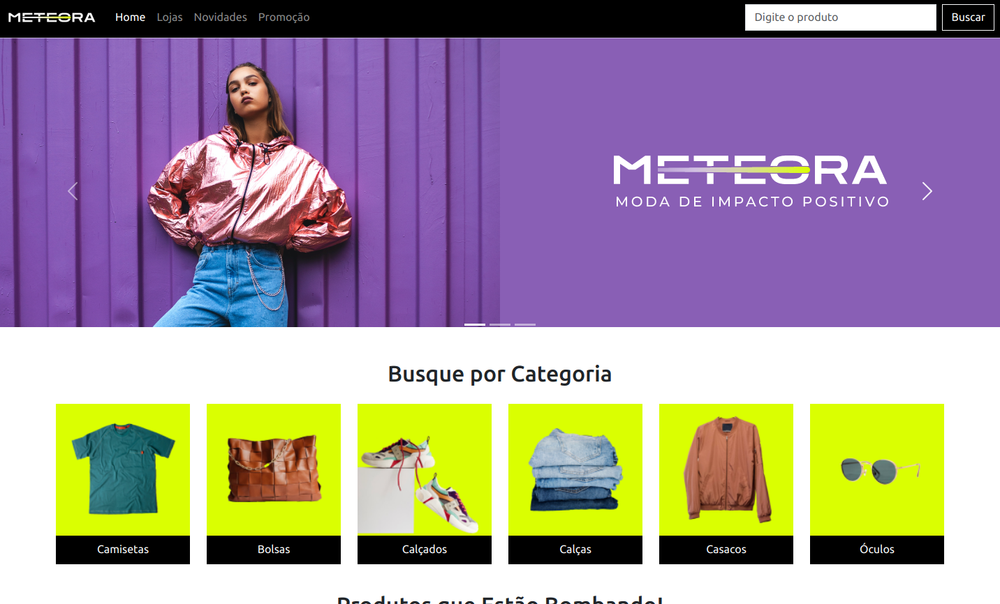

# Meteora

E-commerce de vestuário fictício, desenvolvido utilizando os recursos do Bootstrap 5, aproveitando ao máximo suas classes e componentes para garantir uma experiência responsiva e visualmente atrativa em diferentes dispositivos, desde desktops até smartphones. Navegue por ele clicando [aqui](https://meteora-mariag.netlify.app/). 

## Imagens

## Objetivo

- Aprender o uso do Bootstrap.

## Funcionalidade

- Possui acessibilidade;
- Responsividade dispositivo.

## Tecnologias utilizadas

* HTML;
* CSS;
* Boostrap.
